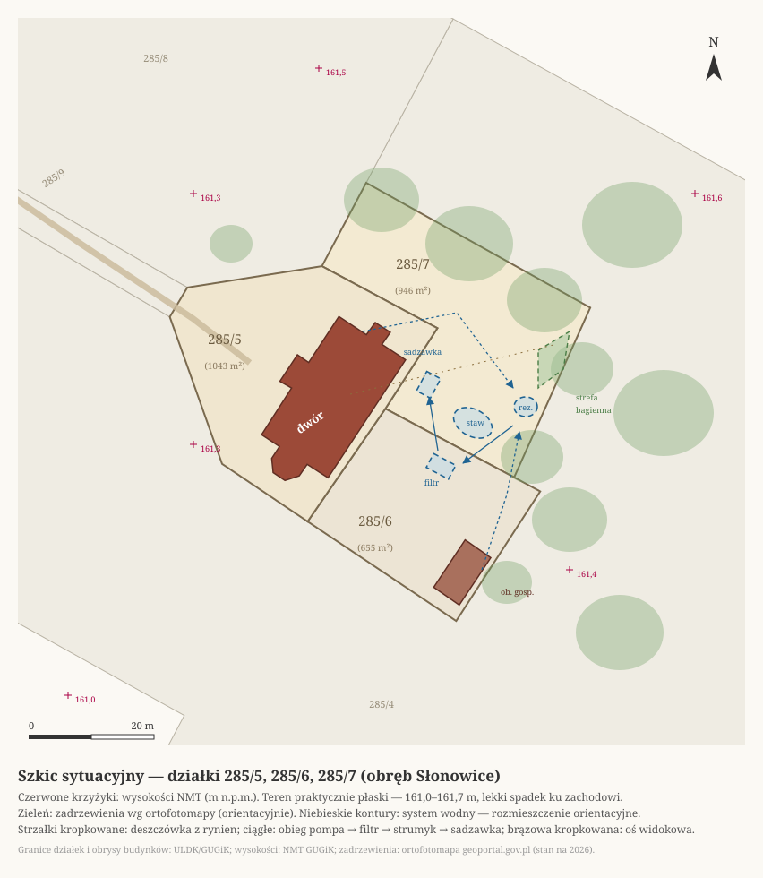

# Woda przy dworze — retencyjny ogród wodny z głębią do zanurzenia

Potrzeby, które ta koncepcja realizuje:
estetyka z wyraźną, murowaną granicą wody;
bioróżnorodność (żyjątka, rośliny wodne i bagienne,
wilgociolubne drzewa: metasekwoja i cypryśnik błotny);
okazjonalna kąpiel „na pełne zanurzenie";
retencja deszczówki z dachów do podlewania;
w przyszłości chłodzenie budynku;
całość odporna na mróz i brak opieki.

Wynik: **dwudzielny system oczek zasilany deszczówką —
część reprezentacyjna na stałym lustrze
(murowana sadzawka kąpielowa + naturalny staw)
i roboczy rezerwuar, który przyjmuje całą zmienność**.

## Kontekst miejsca

Dwór jest częścią zespołu dworsko-folwarcznego w ewidencji zabytków.
Folwarki i majątki ziemskie z końca XIX wieku prawie zawsze miały wodę:
stawy gospodarcze, sadzawki przeciwpożarowe, oczka w parku dworskim.
Naturalny zbiornik wodny nie jest więc obcym dodatkiem,
tylko powrotem do typowego elementu takiego założenia.
Turkusowy basen z rolowaną plandeką — odwrotnie:
kłóciłby się z ceglanym, bezstylowym dworem.
Formalna strona ewidencji i planu miejscowego —
w sekcji o formalnościach.

## Odrzucone warianty

Rozważone i odrzucone — z powodami, żeby nie wracały:

- **Basen klasyczny (chlorowany lub solankowy)**:
  drogi w budowie i utrzymaniu,
  wymaga regularnej, technicznej obsługi (pompy, chemia, zimowanie),
  jest bez życia biologicznego
  i najtrudniejszy do wpisania w zabytkowe otoczenie.
- **Klasyczny staw kąpielowy (basen naturalny)**:
  rygor czystości wody gryzie się z rybami i swobodnym życiem biologicznym,
  a kąpiel jest u nas okazjonalna, nie codzienna.
- **Staw naturalny (nieuszczelniony, na wodzie gruntowej)**:
  woda gruntowa leży za głęboko, żeby naturalne dno utrzymało wodę —
  szczegóły w sekcji o uszczelnieniu.

Wybrany kierunek bierze z każdej z tych opcji to, co pasuje:
skalę i prostotę formalną przydomowych oczek wodnych,
strefę regeneracyjną ze stawów kąpielowych (filtr hydrofitowy)
i małą architekturę wodną (strumyk, przelewy, murowana sadzawka).

## Dlaczego to się dobrze składa

Potrzeby wypisane na wstępie nie konkurują ze sobą — wzajemnie się wzmacniają:

- Deszczówka z dachu to woda miękka i uboga w substancje odżywcze —
  idealna do stawu, bo hamuje glony.
- Głębokie strefy (sadzawka do zanurzenia, dołek w stawie, rezerwuar) to jednocześnie
  zimowisko dla ryb, stabilny termicznie zapas wody na suszę
  i chłodny rezerwuar pod przyszłą klimatyzację.
- Przelew na łąkę rozsączającą jest jednocześnie odbiornikiem nadmiaru wody po ulewie
  i najwilgotniejszym miejscem na działce —
  czyli miejscem dla metasekwoi i cypryśnika
  (ile tej wilgoci realnie jest — sekcja o łące rozsączającej).
- Wahania poziomu (nieuniknione przy retencji) psułyby murowane krawędzie wizualnie —
  więc w całości spychamy je do dzikiego rezerwuaru,
  gdzie zmienna linia wody jest cechą krajobrazu i atutem siedliskowym.

## Schemat systemu: część górna (reprezentacyjna) i dolna (rezerwuar)

System dzieli się na dwie części o różnych rolach:
**górna pracuje zawsze na stałym, pełnym lustrze** (krawędzie przelewowe),
**dolna przyjmuje całą zmienność** — ulewy, susze, pobór na podlewanie.
Teren jest praktycznie płaski (sekcja o rozmieszczeniu),
więc różnice poziomów buduje konstrukcja:
podniesione lustro sadzawki i zagłębiony rezerwuar.

```
                CZĘŚĆ GÓRNA — stałe lustro, reprezentacja
   ┌─────────────────────────────────────────────────────┐
   │  sadzawka kąpielowa                ← murowana, lustro podniesione ~0,6 m,
   │     │                                głębokość 1,8 m, najczystsza woda
   │     ▼ przelew ostrą krawędzią
   │  staw górny                        ← rośliny, ryby, żyjątka,
   │     │                                lustro stałe (krawędź przelewowa)
   └─────│───────────────────────────────────────────────┘
         ▼ przelew grawitacyjny                    rynny dworu
                                                      │
                CZĘŚĆ DOLNA — robocza                 ▼
   ┌─────────────────────────────────────────── osadnik + odrzut
   │  zbiornik dolny (rezerwuar)        ←──────  pierwszej wody
   │     │  przyjmuje deszczówkę i wszystkie wahania poziomu,
   │     │  zapas na suszę i podlewanie, dzikie brzegi
   │     │
   │     │ pompa (sezonowo) ──▶ filtr hydrofitowy ──▶ strumykiem
   │     │                                            do sadzawki
   │     ▼ przelew awaryjny
   │  łąka rozsączająca                 ← nadwyżka wsiąka w grunt,
   │                                      tu metasekwoja i cypryśnik
   └─────────────────────────────────────────
```

Obieg wody: pompa ciągnie z dna rezerwuaru → filtr hydrofitowy →
strumykiem do sadzawki (najczystsza woda tam, gdzie kąpiel) →
przelew do stawu górnego → przelew grawitacyjny z powrotem do rezerwuaru.
Deszczówka z dachu wpada zawsze do rezerwuaru —
brud i uderzenie ulewy nigdy nie dotykają części górnej.

Zalety tego podziału:

- Część reprezentacyjna (sadzawka + staw przy dworze) ma **zawsze idealnie pełne lustro** —
  murowane krawędzie bez smug, zero widocznej folii, niezależnie od pogody.
- Rezerwuar może sobie pozwolić na duże wahania (nawet ±50 cm i więcej),
  bo jego dzikie, łagodne brzegi na tym zyskują:
  odsłaniane błotniste brzegi to magnes na ptaki, ważki i płazy —
  najcenniejsza przyrodniczo strefa w całym systemie.
- Pobór do podlewania — z rezerwuaru, nie sprzed oczu.
- Zimą pompa stoi: część górna po prostu trwa pełna,
  a rezerwuar spokojnie gromadzi wodę z dachu na wiosnę.

Koszt tej wygody: pompa musi stale podnosić wodę o różnicę wysokości
(~2 m z lustra rezerwuaru do wlotu filtra;
przy wolnym obiegu to wciąż dziesiątki watów, nie setki),
i jest jeden zbiornik więcej do wykopania i wyłożenia folią.

Bilans lustra całego systemu:
sadzawka ~9 m² + staw górny ~20 m² + filtr ~10 m² + rezerwuar ~9 m² ≈ **48 m²** —
celowo z marginesem pod progiem 50 m²,
bo powierzchnię wykonaną mierzy się po obrysie lustra, nie po projekcie
(formalna strona progu — w sekcji o formalnościach).

## Staw górny — parametry robocze

- Powierzchnia: **ok. 20 m²** — największy składnik bilansu lustra
  (sekcja o schemacie systemu).
- Strefy: bagienna (0–20 cm) → płytka roślinna (20–60 cm) → otwarta toń (60–120 cm),
  z dołkiem **1,2–1,4 m** jako zimowiskiem ryb.
  Strefa bagienna na stałym lustrze to jedyne trwałe siedlisko bagienne w systemie —
  na gruncie za przelewem takie nie powstaje
  (dlaczego — sekcja o łące rozsączającej).
- Lustro stałe — krawędź przelewowa do rezerwuaru;
  to tu mieszka większość roślin wodnych i ryby.
- Głębia kąpielowa 1,7–1,9 m jest w **murowanej sadzawce** (sekcja niżej);
  staw górny zostaje czysto naturalny, z łagodnymi skarpami.
- Wejście do kąpieli: schodki/drabinka w sadzawce murowanej;
  pomost drewniany nad stawem górnym jako miejsce do siedzenia i obserwacji.

## Zbiornik dolny — rezerwuar roboczy

- Lustro małe (~8–10 m²), ale **głęboki — ok. 2 m**, o stromszych skarpach:
  zapas wody robi głębokość i amplituda, nie powierzchnia
  (mniejsze lustro = mniejsze parowanie z części, która ma wodę *trzymać*).
- Robocza amplituda poziomu do ~1 m → **8–10 m³ dyspozycyjnego zapasu**
  na podlewanie i dolewanie w suszę, poniżej tego strefa „martwa" dla życia w mule.
- Brzegi dzikie, łagodne przynajmniej z jednej strony (wyjście dla płazów i jeży),
  wokół roślinność znosząca zmienny poziom (turzyce, sity, mięta nadwodna).
- Ulewa podnosi lustro o kilkadziesiąt centymetrów — po to on jest
  (liczby w sekcji o bilansie);
  nadmiar ponad maksimum wychodzi przelewem awaryjnym na łąkę rozsączającą
  (sekcja niżej).
- Opcjonalne wzmocnienie: **podziemna cysterna** obok (np. 5 m³) na czystą deszczówkę
  do podlewania — zero parowania i nie wlicza się w lustro wody;
  zbiorniki na wody opadowe do 5 m³ nie wymagają formalności.

## Łąka rozsączająca — co robi nadwyżka wody

Za przelewem awaryjnym rezerwuaru nadwyżka wychodzi na naturalny grunt, bez folii.
To **łąka rozsączająca, nie bagno**: sama woda z przelewu bagna nie zrobi,
bo dopływu jest wielokrotnie za mało w stosunku do chłonności gruntu:

- Nadwyżka bilansu (liczby w sekcji o bilansie) rozkłada się
  na półrocze październik–kwiecień, czyli średnio **~0,3 m³/dobę** —
  i to nie strumieniem, a impulsami:
  10 mm deszczu daje ~1,5 m³ z dachów w godzinę-dwie, potem nic przez dni.
- Nawet grunt słabo przepuszczalny (glina piaszczysta) przyjmuje rzędu 80 mm/dobę,
  czyli ~1,7 m³/dobę na 20 m² rozsączania — kilka razy więcej, niż dopływa;
  na piasku wielokrotnie więcej.
- Woda gruntowa leży głębiej niż 5 m (sekcja o uszczelnieniu),
  więc nic nie podpiera poziomu od dołu — po impulsie grunt po prostu wysycha.

Realny obraz: na piasku woda po ulewie znika w godziny,
na glinie piaszczystej stoi dzień lub dwa,
w roztopy i wczesną wiosną jest tam wilgotno,
a przez większość roku to zwykła łąka, tylko wilgotniejsza niż reszta terenu.
Tyle metasekwoi i cypryśnikowi wystarcza (sekcja o roślinach) —
i tak właśnie trzeba to miejsce traktować, planując nasadzenia.

Jest jedno „ale", które rozstrzyga odkrywka koparką (lista „Do ustalenia"):
**pod zwartą gliną zwałową albo iłem** ta sama ulewa schodzi tygodniami,
i wtedy sezonowo mokre zaniżenie naprawdę powstaje.
Mokro robi wówczas nieprzepuszczalne podłoże, nie bilans dopływu —
więc dopóki gruntu nie znamy, planujemy łąkę,
a ewentualne bagno traktujemy jako prezent od geologii.

**Uszczelniona niecka bagienna** (folia z podłożem, dolewana pompą)
dałaby bagno niezależnie od gruntu, ale odpada:
podłoże bez otwartego lustra ostrożniej liczyć do progu 50 m²
(ta sama wątpliwość co przy złożu filtra — sekcja o filtrze hydrofitowym),
drzewa i tak muszą rosnąć poza folią (korzenie),
a płytka woda paruje w systemie najszybciej —
latem trzeba by ją dolewać z rezerwuaru,
konkurencyjnie do sadzawki i podlewania.
Trwałe siedlisko bagienne mamy w strefie bagiennej stawu górnego.

Wielkość i miejsce rozsączania to kwestia terenowa, nie obliczeniowa:
20–40 m² łagodnego zaniżenia wystarcza z zapasem,
byle nadwyżka rozchodziła się po własnej działce
(strona formalna — w sekcji o formalnościach).

## Osadnik i odrzut pierwszej wody

Deszczówka z dachu niesie pyłki, sadzę, ptasie odchody i liście —
najwięcej w pierwszych minutach opadu, gdy deszcz zmywa dach.
Dlatego między rynną a rezerwuarem stoją proste urządzenia
(osobny komplet przy każdej z dwóch zlewni — dworu i obiektu gospodarczego):

- **Kosz na liście** w rynnie albo łapacz na rurze spustowej —
  zatrzymuje grube części, zanim cokolwiek popłynie dalej.
- **Odrzut pierwszej wody (first flush)**: pionowa rura-kolumna,
  która napełnia się jako pierwsza i przyjmuje najbrudniejsze
  ~0,5–1 mm opadu ze swojej zlewni
  (dach dworu → 50–100 l, dach gospodarczy → 25–50 l);
  gdy kolumna jest pełna, reszta opadu płynie górą do osadnika.
  Kolumna opróżnia się sama przez mały otwór kroplowy —
  zero ruchomych części i sezonowych czynności.
- **Osadnik**: studzienka, w której woda zwalnia i zostawia piasek,
  zanim wpadnie do rezerwuaru.

Rury ułożone ze spadkiem, bez syfonów —
zimą nie stoi w nich woda, więc mróz nie ma czego rozerwać
(ta sama zasada co w sekcji „Zima").
Czyszczenie kosza i osadnika — sezonowo, w wolnej chwili;
to czynność z gatunku „poprawia jakość wody, ale nie jest krytyczna"
(sekcja „Zima").

## Uszczelnienie (całość)

Wszystkie zbiorniki na **folii EPDM** (trwalsza od PVC, ~50 lat).
Decyzja przesądzona: woda gruntowa leży szacunkowo głębiej niż 5 m
(piwnica dworu schodzi ~1,5 m w grunt i nie nosi śladów wody gruntowej),
więc naturalne dno nie utrzyma wody — system żyje wyłącznie z deszczówki.
Plus tej sytuacji: wykopy będą suche (bez wyporu i odwadniania),
a prawnie całość to „oczka wodne" — szczegóły w formalnościach.

## Mur, beton i podniesione lustro — sadzawka kąpielowa

Murowanie **całego** stawu nie ma sensu:
żelbet szczelny hydrotechnicznie jest drogi,
świeży beton alkalizuje wodę (pH w górę — źle dla życia biologicznego),
a naturalne, łagodne brzegi i tak są potrzebne
płazom, ślimakom i roślinom strefowym.

Ale murowana **część** — jak najbardziej, i to w konkretnej roli:
**wydzielona sadzawka kąpielowa z podniesionym lustrem**, najbliżej dworu.

- Wymiar ~2,5×3,5 m, prostokątna, ściany żelbetowe
  licowane **kamieniem polnym** — materiałem, z którego na Pomorzu
  budowano podmurówki i budynki folwarczne;
  taka sadzawka wygląda jak historyczny element założenia, nie jak nowy basen.
- **Podniesione lustro rozwiązuje problem głębi**:
  zamiast kopać 1,9 m, kopiemy ~1,2–1,3 m i wynosimy mur ~0,6 m nad grunt —
  razem 1,8 m wody do zanurzenia, o połowę płytszy wykop,
  a murek jest jednocześnie siedziskiem (wysokość ławki).
- Szczelność: konstrukcja z betonu, ale uszczelnienie **folią EPDM wewnątrz**,
  schowaną za okładziną kamienną poniżej lustra —
  pewniejsze i tańsze niż „szczelny beton", i folia łączy się z resztą systemu.
- Fundament poniżej strefy przemarzania (~0,8–1 m — i tak jest, bo niecka głębsza).
- Lód: konstrukcja pasywna, zero sezonowych czynności —
  szczegóły w sekcji „Zima" niżej.

Kluczowy trik z „wyraźną granicą wody":
sadzawka pracuje **zawsze po brzegi pełna, z krawędzią przelewową** —
woda przelewa się ostrą linią (klinkier/kamień cięty) do stawu górnego.
Dzięki temu:

- lustro w sadzawce stoi idealnie równo z krawędzią muru — efekt „infinity", zero smug i odsłoniętej folii;
- wszystkie **wahania poziomu spływają na sam dół, do rezerwuaru**,
  gdzie zmienna linia wody wygląda naturalnie i nikomu nie przeszkadza;
- przelew to dodatkowy dźwięk wody przy tarasie.

Sadzawka dostaje zawsze wodę prosto po filtrze — najczystszą w całym systemie,
dokładnie tam, gdzie się człowiek zanurza.
Na płaskim terenie to podniesione lustro robi cały spadek kaskady:
od krawędzi sadzawki woda schodzi grawitacyjnie do stawu
i dalej do zagłębionego rezerwuaru.

Murowana krawędź może się też pojawić na **jednym brzegu stawu górnego**
(od strony dworu/tarasu — kamień, linia prosta),
podczas gdy pozostałe brzegi zostają naturalne.
Formalny front, dzika reszta — to klasyczny układ ogrodów przydworskich
i dobrze gra z osiami widokowymi z okien.

## Filtr hydrofitowy — jak utrzymać wodę „ultraczystą"

Intuicja jest trafna:
duży, płytki obszar z szybkorosnącą roślinnością,
przez który przepuszcza się wodę,
to dokładnie **strefa regeneracyjna / filtr hydrofitowy** znany ze stawów kąpielowych.
Rośliny i biofilm na żwirze wyciągają z wody azot i fosfor,
a bez tych pierwiastków glony nie mają z czego rosnąć.

Parametry robocze:

- Osobna, płytka komora (10–40 cm wody) wypełniona **płukanym żwirem 8–16 mm**,
  obsadzona gęsto roślinami — woda przepływa przez złoże, nie po powierzchni.
  Na płaskim terenie komora stoi na nasypie,
  z lustrem powyżej krawędzi sadzawki —
  inaczej strumyk nie miałby spadku;
  nasyp robi urobek z wykopów.
- Wielkość: w klasycznych stawach kąpielowych strefa filtracyjna
  to 30–50% powierzchni lustra;
  przy naszym profilu użytkowania (kąpiel okazjonalna, mała obsada ryb)
  wystarczy dolny kraniec — **ok. 10 m²** (tyle jest w bilansie lustra).
- Przepływ: mała pompa przy dnie rezerwuaru (najzimniejsza, najbogatsza w osady woda),
  obieg całości w 1–2 doby — pobór rzędu 30–60 W plus podnoszenie,
  realnie do zasilenia panelem PV, bo filtr i tak pracuje głównie latem.
- Po filtrze woda płynie strumykiem do sadzawki — natlenienie gratis i klimat gratis.
- **Kluczowy rytuał**: jesienią ścinać i wynosić biomasę poza staw.
  Dopiero wyniesienie roślin fizycznie usuwa składniki mineralne z obiegu;
  rośliny zostawione na zimę oddadzą wszystko z powrotem do wody.

Uwaga do trzciny:
trzcina pospolita filtruje znakomicie, ale jest bardzo ekspansywna,
a jej twarde kłącza potrafią **przebić folię**.
W komorze uszczelnionej lepsze są:
**oczeret jeziorny, pałka wąskolistna (w ograniczeniu), manna mielec, mozga, kosaćce, sity, tatarak**.
Jeśli trzcina ma być — to na łące rozsączającej za przelewem
(naturalny grunt, bez folii, więc kłącza nie mają czego przebić);
przy wilgotności okresowej i tak nie rozejdzie się tak szeroko,
jak na stałym podtopieniu.

Filtr wliczyć w bilans lustra (sekcja o schemacie systemu):
złoże żwirowe bez otwartego lustra można argumentować poza progiem formalnym,
ale ostrożniej liczyć je do środka.

## Zima — odporność na mróz bez żadnej obsługi

Wymóg projektowy: system ma przetrwać każdą zimę **bez udziału człowieka**,
bo nie da się zagwarantować, że ktoś będzie się nim opiekował rok w rok.
Konsekwencje konstrukcyjne:

- **Sadzawka murowana**: żadnego sezonowego spuszczania wody ani pływaków.
  Zamiast tego konstrukcja pasywna:
  ściany pochylone do środka ~10–15° od pionu
  (rosnący lód ślizga się w górę po skosie zamiast napierać poziomo na mur),
  pas płyt kompresyjnych XPS za folią w strefie ±30 cm od lustra
  (przejmuje resztę rozporu),
  beton mrozoodporny, kamień granitowy i spoiny na zaprawie mrozoodpornej,
  kamienne czapy muru z okapnikiem.
- **Hydraulika samoopróżniająca się**: pompa leży przy dnie rezerwuaru (~2 m — nigdy nie zamarza),
  wszystkie rury ułożone z ciągłym spadkiem, bez syfonów i zaworów zwrotnych,
  które trzymałyby wodę — gdy pompa staje (zima albo brak prądu),
  rurociąg i strumyk **opróżniają się grawitacyjnie same**.
  Nie ma elementu, który mróz mógłby rozerwać.
- **Filtr hydrofitowy**: płytkie złoże może przemarznąć na wylot —
  żwir i folia EPDM znoszą to bez szkody, rośliny szuwarowe zimują w gruncie.
- **Ryby**: dołek 1,2–1,4 m w stawie górnym nie przemarza
  (na Pomorzu Zachodnim lód rzadko przekracza 30 cm).
  Ryzyko przyduchy w długie, śnieżne zimy ograniczamy pasywnie:
  mała obsada ryb i niedokarmianie — a nie przeręblami, których nikt nie wyrąbie.
  W najgorszym razie giną pojedyncze ryby, nie system.
- **Krawędzie przelewowe**: cienka warstwa przelewającej się wody może zamarzać
  i rozmarzać dowolnie — to otwarte kamienne progi, bez rur, nie ma czego uszkodzić.
- **Betonowe elementy zawsze pod wodą** (poniżej ~0,5 m) nie przechodzą cykli
  zamarzania — degradacja mrozowa dotyczy tylko strefy lustra,
  i tam pracują skos, XPS i materiały mrozoodporne.

Zasada ogólna: wszystko, co wymagałoby corocznego rytuału,
zostało zastąpione geometrią i grawitacją.
Jedyne czynności „opiekuńcze" (zbiór biomasy, czyszczenie osadnika)
poprawiają jakość wody, ale ich zaniechanie niczego nie niszczy.

## Bilans wodny — liczby dla naszych warunków

Dane wejściowe: zlewnia = **tylna połać dachu dworu ~100 m²
+ dach obiektu gospodarczego (9×5 m z okapami) ~50 m² = ~150 m²**;
lustro wody całego systemu ~50 m²;
opad roczny w Zachodniopomorskiem ~600 mm.
Formuła: 1 mm deszczu × 1 m² dachu = 1 litr.

Przychody (rocznie):

- Dachy 150 m²: 90 m³ teoretycznie, realnie ~72 m³ (straty na osadnikach i odrzucie pierwszej wody).
- Deszcz padający wprost na lustro: ~30 m³.
- **Razem ~100 m³/rok.**

Rozchody (rocznie):

- Parowanie z lustra + transpiracja roślin (filtr paruje intensywniej niż otwarta woda):
  średnio ~0,7 m słupa wody → **~35 m³/rok**, prawie w całości maj–wrzesień.

**Saldo: ok. +65 m³/rok** — system domyka się z dużym zapasem,
a nadwyżka (głównie październik–kwiecień) wychodzi przelewem
na łąkę rozsączającą i wsiąka w grunt
(co to znaczy dla wilgotności tego miejsca — sekcja o łące rozsączającej).

Test suszy (najgorszy scenariusz, zero dopływu):

- Parowanie w upały ~4–5 mm/dzień z całego lustra (~50 m²) = ~0,25 m³/dzień.
  Pompa uzupełnia część górną do krawędzi przelewowych,
  więc **cały ubytek schodzi na rezerwuar**: 4 tygodnie suszy = ~7 m³,
  czyli większość jego roboczego zapasu (8–10 m³) — ale się mieści.
- Zaleta zlewni 150 m²: każdy przelotny deszcz 10 mm to +1,5 m³ w rezerwuarze,
  więc pełne wyczerpanie zapasu wymaga naprawdę długiej suszy bez kropli.
- Podlewanie z rezerwuaru w suszy konkuruje z parowaniem —
  realny budżet to ~5 m³ dla roślin priorytetowych;
  cysterna podziemna staje się opcją komfortu, nie koniecznością.
- Gdy rezerwuar sięgnie minimum, pompę wyłącza pływakowy czujnik suchobiegu
  (standard w pompach) — część górna przestaje być uzupełniana
  i zaczyna powoli parować w dół od pełna;
  rośliny i ryby w stawie górnym mają wtedy jeszcze wielotygodniowy zapas głębokości.

Ulewa 30 mm: 4,5 m³ z dachów w godzinę-dwie → +45–55 cm w rezerwuarze —
mieści się w amplitudzie, nadmiar zrzuca przelew awaryjny na łąkę rozsączającą.

Wniosek: **150 m² zlewni daje bilans z komfortem** —
dlatego dach gospodarczy podpinamy od razu, nie „kiedyś"
(stoi na działkach tylnych tuż przy systemie, rura będzie krótka;
komplet osadnika — w sekcji o osadniku i odrzucie pierwszej wody).
Sama tylna połać dworu (100 m²) też by system utrzymała,
ale latem „na styk" i bez zapasu na podlewanie.
Nie dolewać kranówki poza sytuacją awaryjną:
twarda woda wodociągowa wnosi minerały, które napędzają glony
i psują główny atut zasilania deszczówką.

## Chłodzenie budynku — co zrobić teraz

Realia: system ~40 m³ może latem oddać kilka kWh chłodu dziennie
(wymiennik przy dnie rezerwuaru + klimakonwektor w budynku),
ale każde chłodzenie budynku **grzeje staw** —
tygodniowy upał przy poborze 3 kW to ok. +2–3°C dla całej wody.
Dla ekosystemu to granica rozsądku, więc staw będzie raczej
*wspomaganiem* (pre-cooling, chłodzenie jednego pomieszczenia)
niż pełną klimatyzacją dworu.

Decyzja techniczna dziś nie jest potrzebna. Wystarczy:

1. lokalizować system **blisko dworu** (krótkie rynny, krótka pętla chłodząca),
2. przy kopaniu **zakopać peszel/rurę osłonową** od rezerwuaru do fundamentu —
   koszt pomijalny, a oszczędza rozkopywanie gotowego ogrodu za 5 lat.

## Rośliny i żyjątka

- **Metasekwoja chińska i cypryśnik błotny**: oba mrozoodporne na Pomorzu Zachodnim,
  oba docelowo to drzewa 20–30 m — sadzić na łące rozsączającej,
  **poza folią** (korzenie!), min. kilka metrów od uszczelnienia.
  Oba rosną na zwykłej, wilgotnej glebie ogrodowej,
  więc okresowa wilgotność łąki im wystarcza (sekcja o łące rozsączającej);
  cypryśnik jako odporniejszy na zalanie idzie bliżej przelewu,
  metasekwoja dalej, gdzie woda nigdy nie stagnuje.
  W suszy to one mają pierwszeństwo w podlewaniu z rezerwuaru
  (budżet wody — w sekcji o bilansie).
  Pneumatoforów nie będzie — cypryśnik wypuszcza je, stojąc w wodzie na stałe.
  Uwaga: oba zrzucają igły — nie sadzić od strony nawietrznej stawu.
- Strefa bagienna stawu górnego: kosaćce, krwawnica, knieć błotna, turzyce,
  pałka wąskolistna (w pojemniku!).
- Toń: grążel/grzybienie, rogatek jako natleniacz.
- **Ryby: mało i drobne** — słonecznica, kiełb, ewentualnie liny.
  Duża obsada rybna = nawożenie wody = glony,
  a przy okazji ryby zjadają skrzek płazów.
  Ślimaki (zatoczki, błotniarki) przyjdą same z roślinami, podobnie ważki i traszki.

## Bezpieczeństwo

Woda z głębią do zanurzenia przy domu wymaga zwykłych zasad:
dzieci przy wodzie pod okiem dorosłego, lód zimą traktowany jako nienośny.
Konstrukcja pomaga pasywnie, w duchu całego projektu:

- Murek sadzawki działa jak niska bariera —
  do jedynego miejsca z pionowymi ścianami i pełną głębią
  nie da się wejść przypadkiem, trzeba się wspiąć;
  schodki/drabinka w środku to stałe, pewne wyjście.
- Staw górny i rezerwuar mają łagodne skarpy i płytkie strefy przy brzegu:
  kto się poślizgnie, staje w wodzie po kolana, zamiast wpadać na głębię —
  te same łagodne brzegi, które i tak są potrzebne płazom,
  są jednocześnie wyjściem z wody dla człowieka.

## Rozmieszczenie w terenie

Sytuacja: trzy działki w obrębie Słonowice —
**285/5** (~1040 m², frontowa, od drogi) z dworem,
który zajmuje znaczną część (brak miejsca na staw),
oraz niezabudowane **285/7** (~950 m², za dworem od północnego wschodu)
i **285/6** (~660 m², za dworem od południowego wschodu,
z małym obiektem gospodarczym),
dostępne tylko przez działkę z dworem.
Całość ~2650 m² w jednych rękach, funkcjonująca jako jedna posiadłość.



Teren jest praktycznie płaski:
161,0–161,7 m n.p.m. w obrębie działek, z lekkim spadkiem ku zachodowi
(granice, budynki i wysokości na szkicu — ULDK i NMT GUGiK, stan na 2026).
Naturalnych spadków pod kaskadę nie ma —
różnice poziomów buduje konstrukcja
(podniesione lustro sadzawki, zagłębiony rezerwuar).
Wschodnie części działek tylnych są zadrzewione.

Wnioski dla układu:

- **Cały system wodny idzie na działki tylne**, a gradient „formalne → dzikie"
  układa się naturalnie wzdłuż osi od dworu w głąb:
  sadzawka murowana tuż za granicą działki dworskiej,
  w widoku z tylnych okien/tarasu (murowany, reprezentacyjny front systemu),
  za nią staw górny, dalej rezerwuar, na końcu łąka rozsączająca z drzewami.
- **Zlewnia: tylna połać dachu dworu** — rynny z tyłu budynku
  mają najkrótszą drogę do rezerwuaru (rura po/pod ziemią przez granicę działek,
  wszystko na własnym terenie).
- **Dach obiektu gospodarczego to druga zlewnia, podpinana od razu** —
  stoi na działce 285/6 tuż przy systemie, więc rura jest krótka,
  a jego powierzchnia zamienia letni bilans „na styk"
  w komfortowy zapas na podlewanie (liczby w sekcji o bilansie).
- Metasekwoja i cypryśnik na końcu układu (łąka rozsączająca):
  docelowo to drzewa 20–30 m, więc dobrze, że wychodzą daleko
  od fundamentów dworu i od folii zbiorników.
- Praktyczny plus podniesionego lustra sadzawki:
  urobek z wykopów zostaje na miejscu jako podsypka/skarpa pod murek —
  mniej wywożenia ziemi przez wąski przejazd koło dworu.

## Formalności dla tego wariantu

- Uszczelnione zbiorniki ≤50 m² zasilane deszczówką z własnego dachu:
  kwalifikują się jako przydomowe oczka wodne — **bez pozwolenia i bez zgłoszenia**.
- Zgoda wodnoprawna (Prawo wodne) dotyczy zbiorników sięgających wód gruntowych
  lub zasilanych ciekiem —
  uszczelnione niecki zasilane deszczówką jej nie wymagają.
- Przelew awaryjny rozprowadzać na własnym terenie (łąka rozsączająca) —
  nie do rowu/na sąsiada bez uzgodnień.
- Ewidencja zabytków formalnie nie gra
  (brak pozwolenia = brak uzgodnienia z konserwatorem),
  ale grzecznościowa rozmowa z WUOZ nie zaszkodzi, skoro to teren zespołu.

### Co mówi MPZP

Teren jest objęty miejscowym planem zagospodarowania przestrzennego
([uchwała nr XXXIV/203/2022 Rady Gminy Brzeżno, obręb Słonowice](dokumenty/mpzp-slonowice-2022.pdf)).
Nasze działki leżą w terenie elementarnym **MW.1** (~0,29 ha,
zabudowa mieszkaniowa wielorodzinna — dwór).
Dla koncepcji wodnej plan jest **korzystny**:

- Plan wprost **dopuszcza „rozwiązania techniczne służące zatrzymaniu wód
  opadowych i roztopowych" oraz „wykorzystanie wód opadowych do celów gospodarczych"** —
  czyli dokładnie nasz system retencyjny, czarno na białym.
- Odprowadzenie wód opadowych powierzchniowo w grunt jest na terenach mieszkaniowych
  dopuszczone (limit: chłonność gruntu) — łąka rozsączająca jest zgodna z planem,
  a chłonność mamy z dużym zapasem nad dopływem (sekcja o łące rozsączającej).
- Wymóg min. **50% powierzchni biologicznie czynnej** na działce —
  stawy i zieleń tylko pomagają go spełnić.
- Teren leży w **strefie „B" ochrony konserwatorskiej**:
  ochronie podlega rozplanowanie zabudowy, zieleń komponowana i mała architektura,
  a nowe elementy mają nawiązywać do lokalnej tradycji
  (materiały: **kamień, cegła, drewno**) —
  sadzawka licowana kamieniem polnym wpisuje się w to wprost idealnie.
- Dwór jest w planie budynkiem o wartościach zabytkowych:
  m.in. **zakaz prowadzenia rur i kabli po elewacjach frontowych i eksponowanych** —
  rury spustowe do rezerwuaru prowadzić po tylnej (nieeksponowanej) stronie
  albo pod ziemią, co i tak było w planie.
- Zakaz wtórnych podziałów terenu MW.1 — dla stawów bez znaczenia.
- Ciekawostka na przyszłość: za MW.1 leży teren **ZP.6 — park podworski** (~0,69 ha)
  w strefie „K" ochrony krajobrazu, z dostępem właśnie przez MW.1;
  to dawna zieleń komponowana zespołu — kontekst, do którego nasz układ wodny
  może się kiedyś kompozycyjnie odnosić.

MPZP nie zmienia kwalifikacji z Prawa budowlanego (limit 50 m² i „przydomowość"
rozstrzyga się tam) — ale zdejmuje ryzyko, że plan czegoś zakazuje.
Interpretacja starostwa pozostaje wskazana
(zakres pytań — w liście „Do ustalenia").

### Limit 50 m² — na co właściwie?

Przepis (art. 29 Prawa budowlanego) mówi o „przydomowych basenach i oczkach wodnych
o powierzchni do 50 m²" — literalnie limit dotyczy **obiektu**, nie działki.
Ale w praktyce jest ostrożniej:

- Istnieją interpretacje i wyroki liczące **łącznie wszystkie oczka
  przy tym samym domu** — kilka oczek po 40 m² obok siebie
  organ może potraktować jak obejście przepisu.
- Nasza kaskada jest **połączona hydraulicznie w jeden system** —
  to najmocniejszy argument, żeby traktować ją jako jeden obiekt
  i liczyć lustra razem. Stąd projektowe ~50 m² łącznie.
- **Granica działek nie pomaga**: jeden zbiornik leżący na dwóch działkach
  to nadal jeden obiekt o jednej powierzchni.
- **„Przydomowość" trzeba obronić**: system stanie na działkach tylnych,
  a dom stoi na frontowej. Argumenty są dobre —
  ten sam właściciel, działki przylegają, funkcjonują jako jedna posiadłość
  (tylne w ogóle nie mają osobnego dostępu do drogi),
  system jest fizycznie połączony z domem (rynny, przyszła pętla chłodząca) —
  ale orzecznictwo wymaga powiązania funkcjonalnego z budynkiem mieszkalnym
  i organ mógłby się czepiać.
  Dlatego przed budową wziąć **pisemną interpretację ze starostwa** —
  opisać system i tę konfigurację działek; odpowiedź na piśmie to spokój na lata.

Jeśli apetyt kiedyś przerośnie 50 m², wyjściem jest **pozwolenie na budowę** —
to nie zakaz, tylko papierologia:
projektant, mapa do celów projektowych i (skoro teren zespołu jest w ewidencji)
uzgodnienie z konserwatorem.
Przy inwestycji na dekady w zabytkowym założeniu bywa warte zachodu,
bo zdejmuje wszystkie sufity naraz.

## Etapowanie

1. **Teraz**: rozstrzygnąć pozycje z listy „Do ustalenia" (sekcja niżej).
2. **Etap 1 (mały koszt, szybki efekt)**: osadnik + zbiornik dolny (rezerwuar)
   z łąką rozsączającą za przelewem, pierwsze rośliny.
   Już działa retencja, podlewanie i siedlisko;
   można sadzić metasekwoję i cypryśnika (im wcześniej, tym lepiej — to drzewa na dekady).
3. **Etap 2**: filtr hydrofitowy, staw górny, sadzawka murowana,
   pompa z rurociągiem, pomost, peszel do budynku.
4. **Etap 3 (kiedyś)**: pętla chłodząca do budynku.

Rzędy wielkości kosztów (szacunek na ceny 2026, prace zlecone —
do planowania, nie zamiast ofert wykonawców):

- Etap 1: **~10–20 tys. zł**
  (koparka, folia EPDM z geowłókniną, studzienka osadnika, rury, rośliny).
- Etap 2: **~50–90 tys. zł** —
  większość to żelbetowa sadzawka licowana kamieniem;
  staw górny, filtr, pompa i pomost to łącznie mniejsza część.
- Etap 3: **~10–20 tys. zł** (wymiennik, klimakonwektor, orurowanie w peszlu).

## Do ustalenia

- Obejście w terenie ze szkicem sytuacyjnym:
  które zadrzewienia i stare drzewa zostają,
  osie widokowe z konkretnych okien i tarasu,
  docelowe pozycje zbiorników.
- Interpretacja starostwa: „przydomowość" oczek na działkach bez domu, limit 50 m²
  i aktualny stan przepisów o oczkach, basenach
  i zbiornikach na deszczówkę do 5 m³ (bywały nowelizowane).
- Dofinansowanie „Moja Woda" (WFOŚiGW) —
  program obejmował oczka retencyjne, kolejne nabory bywają ogłaszane.
- Odległość metasekwoi i cypryśnika od obiektu gospodarczego
  i od granic z sąsiadami spoza posiadłości.
- Rodzaj gruntu i poziom wody gruntowej z odkrywki koparką —
  stabilność skarp, sposób obudowy rezerwuaru,
  chłonność pod rozsączanie (jak długo po ulewie woda tam stoi),
  ewentualne gruzowisko po PGR.
- Dojazd koparki na działki tylne (przejazd koło dworu).
- Czy zostajemy pod 50 m² łącznie, czy idziemy w pozwolenie
  i uwalniamy skalę (decyzja przed projektem wykonawczym).
